<picture>
  <source media="(prefers-color-scheme: dark)" srcset="assets/terminal-dark.svg">
  <source media="(prefers-color-scheme: light)" srcset="assets/terminal-light.svg">
  
</picture>

  <a href="https://www.linkedin.com/in/raghav-chari/">
    <picture>
      <source media="(prefers-color-scheme: dark)" srcset="assets/chip-linkedin-dark.svg">
      <source media="(prefers-color-scheme: light)" srcset="assets/chip-linkedin-light.svg">
      
    </picture>
  </a>
  <a href="https://scholar.google.com/citations?user=h7TggJAAAAAJ&hl=en">
    <picture>
      <source media="(prefers-color-scheme: dark)" srcset="assets/chip-scholar-dark.svg">
      <source media="(prefers-color-scheme: light)" srcset="assets/chip-scholar-light.svg">
      
    </picture>
  </a>
  <a href="https://arxiv.org/search/?searchtype=author&query=Chari%2C+R">
    <picture>
      <source media="(prefers-color-scheme: dark)" srcset="assets/chip-arxiv-dark.svg">
      <source media="(prefers-color-scheme: light)" srcset="assets/chip-arxiv-light.svg">
      
    </picture>
  </a>

